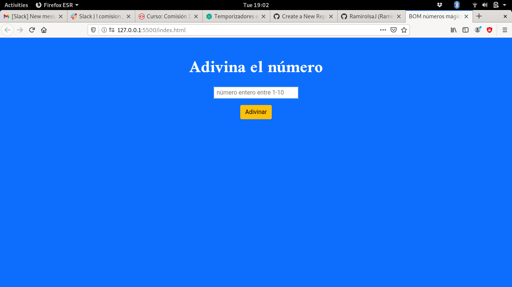
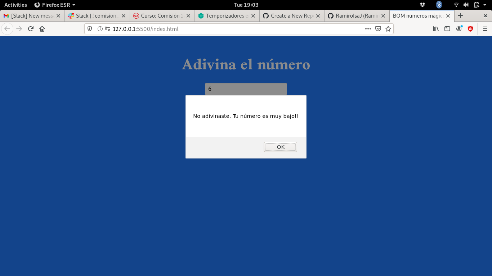
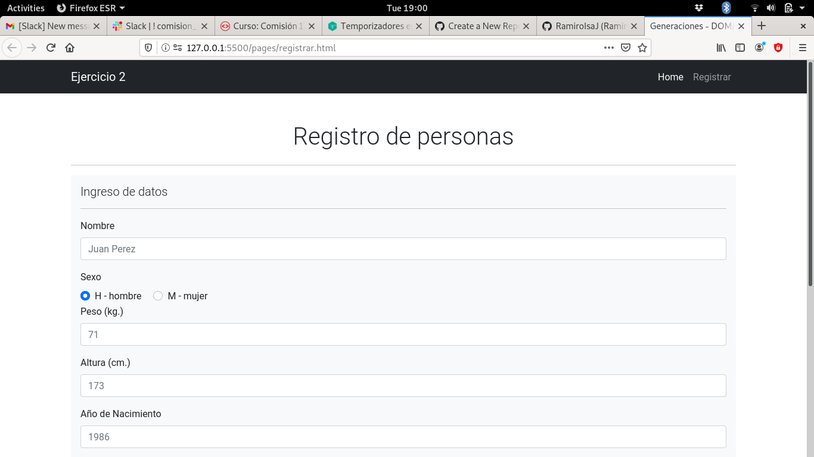
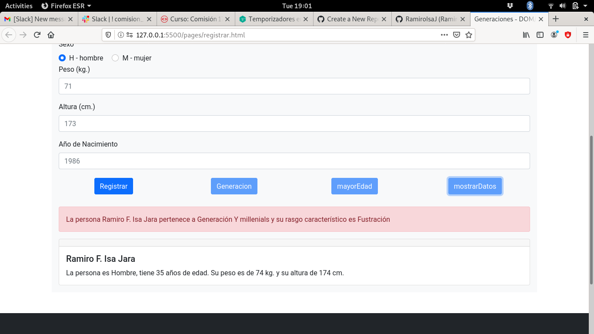
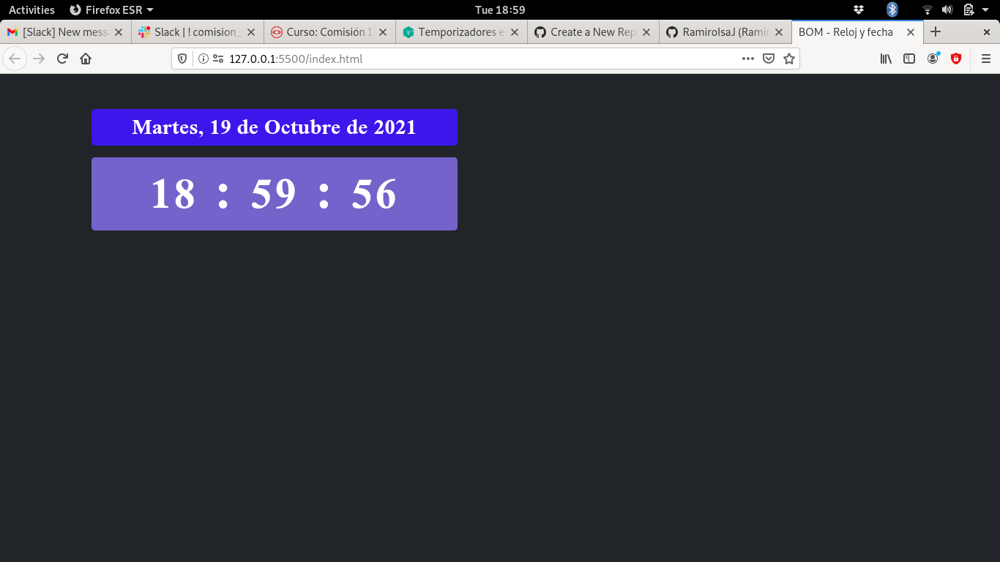
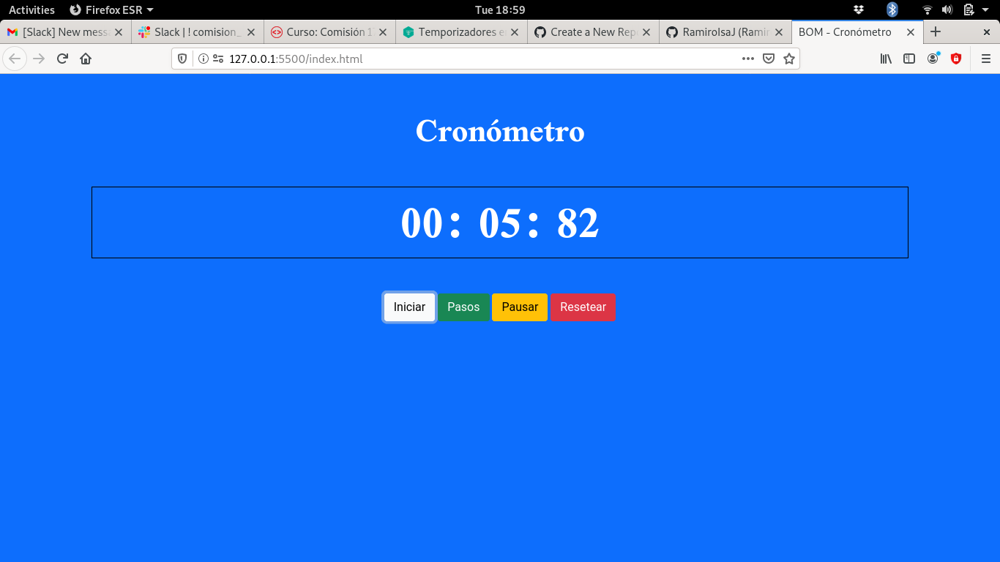
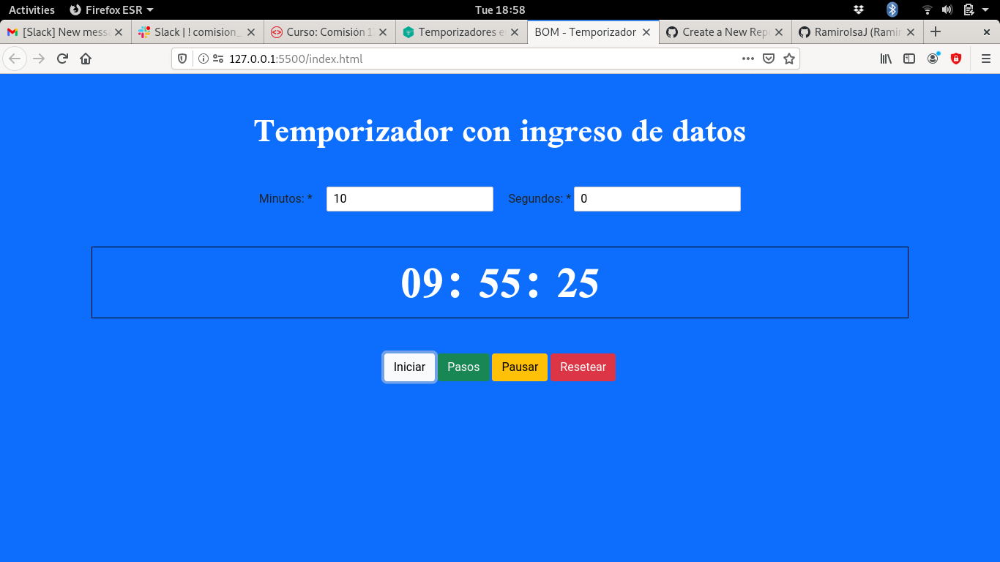

# Práctica de Javascript usando BOM y DOM
Ejercicios correspondiente al TP de BOM y DOM para Rolling Code School.

## Ejercicio 1
Adivinar el número mágico
------------ | -------------
 | 
------------ | -------------

## Ejercicio 2
Registrar usando un formulario una lista de personas. Indicar cúal es su generación y si es mayor de edad. Finalmente muestra todas las personas registradas.
------------ | -------------
 | 
------------ | -------------

## Ejercicio 3
Mostrar la fecha y hora actual en una página web.

## Ejercicio 4
Programar un cronómetro con botones para Iniciar, Pausar, Resetear.

## Ejercicio 4
Programar un temporizados que ingrese el usuario el tiempo desde el cúal irá a decrementar, con botones para Iniciar, Pausar, Resetear.

